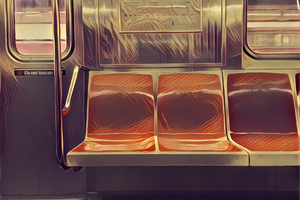

This post assumes you know a little bit about [Eleventy](https://www.11ty.dev/) and have it set up for posts. If not you can head over to the [docs](https://www.11ty.dev/docs/) to find out more. Here we look at how to colocate images with your post.

You may want to opt for this approach as the images you are using will only ever be related to the post you are writing or you just prefer to keep all related files in the same directory.

The alternative is to locate all your images in a top level image directory. A combination of both approaches is likely to be useful.

<p style="display: flex; justify-content: center; margin: 4rem 0">
    <image alt="Empty seats on a New York subway car" width="600" height="400" src="img/subway.jpg" />
</p>


## File Structure

There are a number of ways to set up your posts in Eleventy, the simplest being a markdown file for your post within your posts directory e.g.

```shell
posts
├── my-first-post.md
```

Another approach is to create a directory for your post. For example this post is a directory called `colocate-images-with-post-using-eleventy` and has an `index.md` file which contains the content of the post.

```shell
posts
├── my-first-post.md
├── colocate-images-with-post-using-eleventy
│   └── index.md
```

To colocate images with the post, we can create another directory within the `colocate-images-with-post-using-eleventy` directory; in this case I have called it `img`. With the `img` directory add your images.

```shell
posts
├── my-first-post.md
├── colocate-images-with-post-using-eleventy
│   ├── img
│   │   ├── subway.jpg
│   │   └── umbrellas-and-kites.jpg
│   └── index.md
```

You can then reference your images within `index.md` with markdown like so...

```markdown

```

Or with markup...

```html
<image alt="Empty seats on a New York subway car" width="600" height="400" src="img/subway.jpg" />
```

## Missing Images

Having set up the colocated files I found that when I generated the site the images were missing. It turns out that Eleventy does not copy file extensions that it does not recognise and in this case it ignored the image files with the `jpg` extension.

The way to resolve this is to use the `--formats` flag on the command line when building the site; see [command line usage](https://www.11ty.dev/docs/usage/) in the docs for further information.

### `--formats`

Here is an example of serving the site for development using the `formats` flag. We specify `md` and `jpg` in a comma separated list of file formats that should be copied during the build process.

```shell
npx @11ty/eleventy --serve --formats=md,jpg
```

<p style="display: flex; justify-content: center; margin: 4rem 0">
    <image alt="Beach umbrellas and kites flying" width="600" height="400" src="img/umbrellas-and-kites.jpg" />
</p>

Note that depending on how you deploy your site you may need to modify your configuration to ensure you add the `--formats` flag. For example, if you have continuous integration setup then you will need to add the flag to your build step to ensure the images are copied to the post directory.
